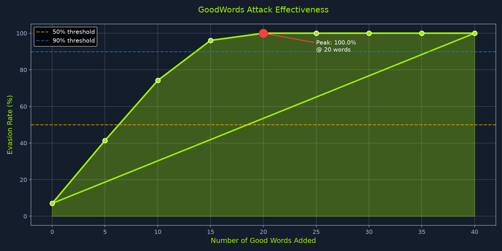
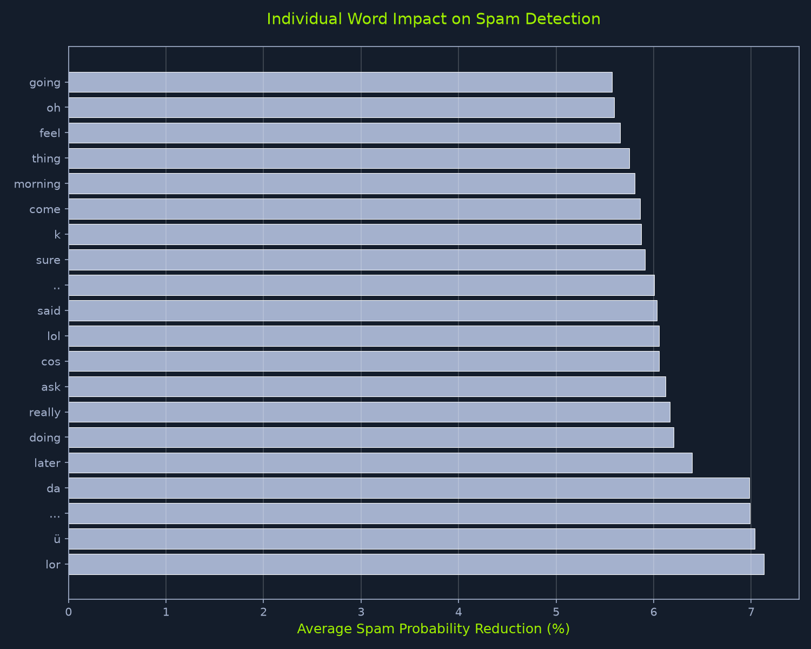
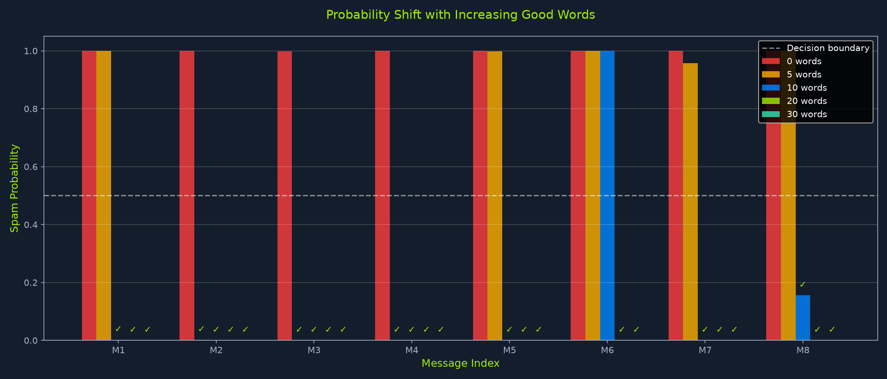

# ML01 - Input Manipulation Attack: GoodWords Attack (White-Box)

This lab demonstrates the **GoodWords attack**, an evasion technique against a Naive Bayes spam classifier. With white-box access to the model, we extract words strongly associated with legitimate (ham) messages and inject them into spam messages to bypass detection.

> **MITRE ATLAS:** [AML.T0054 - Input Manipulation Attack](https://atlas.mitre.org/techniques/AML.T0054)

## Attack Overview

| Property | Value |
|----------|-------|
| **Target Model** | Multinomial Naive Bayes (scikit-learn) |
| **Access Level** | White-box (full model access) |
| **Dataset** | UCI SMS Spam Collection (5,574 messages) |
| **Attack Type** | Evasion via input augmentation |
| **Result** | 100% evasion rate with 20 injected words |

## How It Works

1. **Train a spam classifier** on the SMS Spam Collection dataset using bag-of-words features and Multinomial Naive Bayes.
2. **Extract feature probabilities** directly from the trained model — white-box access exposes `feature_log_prob_` for both classes.
3. **Compute a "goodness score"** for every word in the vocabulary: `ham_probability / spam_probability`. Words with the highest ratio are the most ham-like.
4. **Append top-scoring words** to spam messages. Each added word shifts the log-probability sum toward the ham class, eventually crossing the decision boundary.

### Why Naive Bayes Is Vulnerable

Naive Bayes classifies by summing log-probabilities of each token independently. Appending tokens that don't interact with existing features makes the probability shift purely additive — the attacker controls exactly how much to push the score.

## Steps to Reproduce

### 1. Environment Setup

```bash
python -m venv .GoodWordsAttack
source .GoodWordsAttack/bin/activate
pip install -r requirements.txt
pip install --upgrade git+https://github.com/PandaSt0rm/htb-ai-library
```

### 2. Run the Notebook

```bash
jupyter notebook GoodWordsAttack.ipynb
```

Execute cells sequentially. The notebook handles dataset download, caching, and model persistence automatically.

### 3. Key Sections in the Notebook

**Data Loading & Preprocessing**
- Downloads the UCI SMS Spam Collection (cached locally in `data/sms_spam.csv`).
- Minimal cleaning preserves spam indicators (currency symbols, excessive punctuation).
- Removes duplicates (419 found), splits 80/20 stratified.

**Model Training**
- `CountVectorizer` with 3,000 features, custom token pattern to capture symbols like `£$€¥`, `!!`, `??`.
- `MultinomialNB` trained and saved to `models/spam_classifier.pkl`.
- Baseline performance: **98.55% accuracy**, 0.93 recall on spam.

**GoodWords Extraction (White-Box)**
- Access `classifier.feature_log_prob_` to get per-class probabilities for all 3,000 features.
- Compute goodness score: `ham_prob / spam_prob` for each word.
- Top 10 GoodWords: `lor`, `ü`, `...`, `da`, `later`, `doing`, `really`, `ask`, `cos`, `lol`.

**Attack Execution**
- Augment each spam message by appending the top N GoodWords.
- Test with N = 0, 5, 10, 15, 20, 25, 30, 35, 40.

## Results

| Words Added | Evasion Rate |
|-------------|-------------|
| 0 | 7.03% (9/128) |
| 5 | 41.41% (53/128) |
| 10 | 74.22% (95/128) |
| 15 | 96.09% (123/128) |
| **20** | **100.00% (128/128)** |

The evasion rate follows a sigmoid curve — consistent with the additive log-probability structure of Naive Bayes.

### Attack Effectiveness



### Individual Word Impact

Each GoodWord individually reduces spam probability by ~5-7% on average. The top word (`lor`) contributes a 7.13% reduction per message.



### Probability Shift per Message

Spam probability drops below the 0.5 decision boundary as more GoodWords are appended. With 10 words, most messages evade; with 20, all do.



## Project Structure

```
.
├── GoodWordsAttack.ipynb    # Main notebook with full attack pipeline
├── requirements.txt         # Python dependencies
├── data/
│   └── sms_spam.csv         # Cached SMS Spam Collection dataset
├── models/
│   └── spam_classifier.pkl  # Trained Naive Bayes model
└── attachments/
    ├── attack_effectiveness.png
    ├── word_impact.png
    └── probability_shift.png
```

## Requirements

- Python 3.10+
- numpy, scipy, scikit-learn, matplotlib, seaborn
- torch, torchvision (for the HTB AI library)
- [HTB AI Library](https://github.com/PandaSt0rm/htb-ai-library)

## Takeaways

- **Bag-of-words models are trivially evadable** when the attacker has white-box access. The independence assumption means injected tokens don't interact with existing features.
- **20 words is the threshold** for 100% evasion against this classifier on this dataset.
- **Defenses to consider:** models that capture word order (RNNs, transformers), anomaly detection on message length, or adversarial training with augmented samples.

## References

- [GoodWords Attack - Original Concept](https://atlas.mitre.org/techniques/AML.T0054)
- [UCI SMS Spam Collection Dataset](https://archive.ics.uci.edu/ml/datasets/SMS+Spam+Collection)
- [Hack The Box - Certified Offensive AI Expert (COAE)](https://academy.hackthebox.com/)
